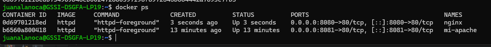
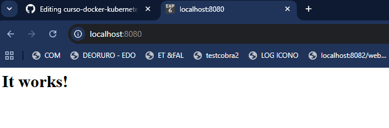

## Clase 1 - Introducción a Containers y Docker

## Objetivo

Desplegar un servidor web con nginx usando Docker.

## Desarrollo

### 1. Ejecutar el container

docker run -d -p 8080:80 --name mi-servidor-web nginx

**Explicación:** Este comando crea y ejecuta un container con nginx en segundo plano (-d), mapeando el puerto 8080 de mi máquina al puerto 80 del container.

**Salida:**

0d69701218edb734969b46cb002472860397196f8972545b664442a7693c7fb3

### 2. Verificar que está corriendo
#### 2.1. comandos
docker ps

**Screenshot:**

### 3. Acceder desde el navegador

Accedí a `http://localhost:8080` y obtuve:

## Conclusiones

Aprendí a ejecutar containers en segundo plano y mapear puertos. Tuve una dificultad inicial con el puerto 8080 ocupado, lo resolví usando el puerto 8081 en su lugar.
