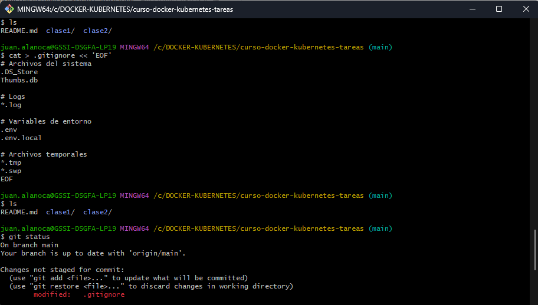
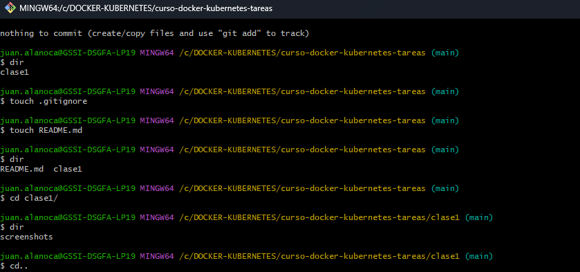

## Clase 1 - Introducción a Containers y Docker

## Objetivo

Desplegar un servidor web con nginx usando Docker.

## Desarrollo

### 1. Ejecutar el container

docker run -d -p 8080:80 --name mi-servidor-web nginx

**Explicación:** Este comando crea y ejecuta un container con nginx en segundo plano (-d), mapeando el puerto 8080 de mi máquina al puerto 80 del container.

**Salida:**

0d69701218edb734969b46cb002472860397196f8972545b664442a7693c7fb3

### 2. Verificar que está corriendo
#### 2.1. comandos
docker ps

**Screenshot:**

### 3. Acceder desde el navegador

Accedí a `http://localhost:8080` y obtuve:

## Conclusiones

Aprendí a realizar una estructura en github para lo requerido ademas de recordar instrucciones para realizar la tarea

## Tarea 1 - Configuración de Repositorio y Primer Desafío
## Parte 1: Configuración del Repositorio Personal
#### 2.1. comandos
git clone https://github.com/tu-usuario/curso-docker-kubernetes-tareas.git
cd curso-docker-kubernetes-tareas

mkdir -p clase1/screenshots

cat > .gitignore << 'EOF'
# Archivos del sistema
.DS_Store
Thumbs.db

# Logs
*.log

# Variables de entorno
.env
.env.local

# Archivos temporales
*.tmp
*.swp
EOF

git add .
git commit -m "mensaje al realizar modificaciones en cada tarea"
git push origin main

**Screenshot:**

### 3. Acceder desde el navegador

Accedí a `http://localhost:8080` y obtuve:

## Conclusiones

Aprendí a ejecutar containers en segundo plano y mapear puertos. Tuve una dificultad inicial con el puerto 8080 ocupado, lo resolví usando el puerto 8081 en su lugar, tambien funcionó matando el pid que usaba otro proceso con ese puerto.

## Tarea 1 - Configuración de Repositorio y Primer Desafío
## Parte 2: Desafío Técnico con Docker
Explora diferentes aplicaciones desplegadas con Docker.
##Aplicación elegida: Apache HTTP Server (httpd)

#### 2.1. comandos
despliegue container
docker run -d --name mi-apache -p 8081:80 httpd
VERIFICACION
# Listar containers en ejecución
docker ps

# Ver logs del container
docker logs mi-apache

# Acceder al servicio (abrir el navegador)
http://localhost:8081

LIMPIEZA:

# Detener el container
docker stop mi-apache

# Eliminar el container
docker rm mi-apache

# Verificar eliminación
docker ps -a

Explicación de flags del comando docker run

-d: Ejecuta el container en modo “detached” (segundo plano)

--name mi-apache: Asigna el nombre “mi-apache” al container

-p 8081:80: Mapea el puerto 8081 del host al puerto 80 del container

httpd: Especifica la imagen a utilizar

####

**Screenshot:**
### 1. Container corriendo

### 2. Acceso desde navegador

Accedí a `http://localhost:8080` y obtuve:

### 3. Container eliminado

Accedí a `http://localhost:8080` y obtuve:

## Conclusiones

Aprendí cómo desplegar rápidamente un servidor web usando Docker

Comprendí la importancia del mapeo de puertos para acceder a los servicios

La documentación fue útil para recordar los comandos exactos

La única dificultad fue recordar que el puerto del container (80 para httpd) es diferente al puerto del host (8081), pero los logs del container ayudaron a confirmar que estaba funcionando correctamente

