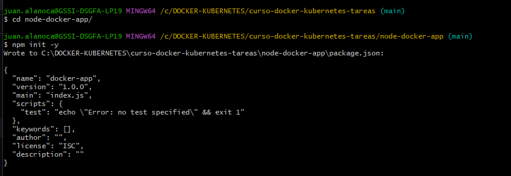
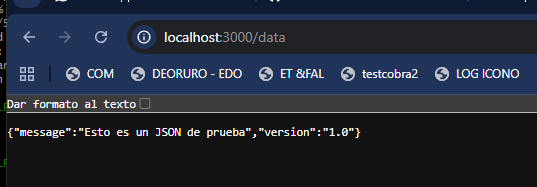
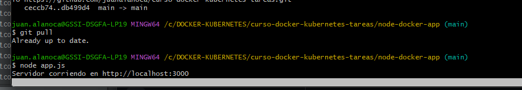
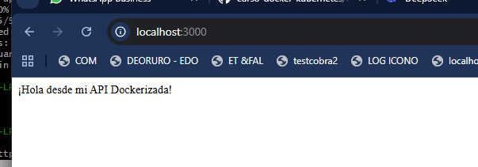

## Tarea 2 - Dockerizar Aplicación con Multi-Stage Build

## Objetivo

Aplicación Node.js con Express como ejemplo. 

## Desarrollo

### Parte 1: Crear una Aplicación Node.js
Vamos a desarrollar una aplicación simple con 2 endpoints y configuración de puerto. 

## 1 Estructura del Proyecto
Crea una carpeta para el proyecto:

mkdir node-docker-app && cd node-docker-app

##  2. Inicializar Node.js
Ejecuta: 
npm init -y

##  3. Instalar Express
npm install express
##  4. Crear el Archivo app.js
const express = require('express');
const app = express();
const PORT = process.env.PORT || 3000;

// Endpoint 1: Saludar
app.get('/', (req, res) => {
    res.send('¡Hola desde mi API Dockerizada!');
});

// Endpoint 2: Obtener datos
app.get('/data', (req, res) => {
    res.json({ message: "Esto es un JSON de prueba", version: "1.0" });
});

app.listen(PORT, () => {
    console.log(`Servidor corriendo en http://localhost:${PORT}`);
});

**Salida:**

#MENSAJE DE BIENVENIDA

#RECIBIR UN MENSAJE JSON

**Screenshot:**

##muestra que la pagina muestra un mensaje en formato json

##corriendo app.js

##Servidor node corriendo en consola

