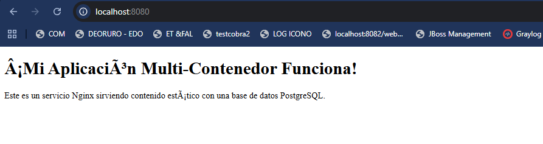
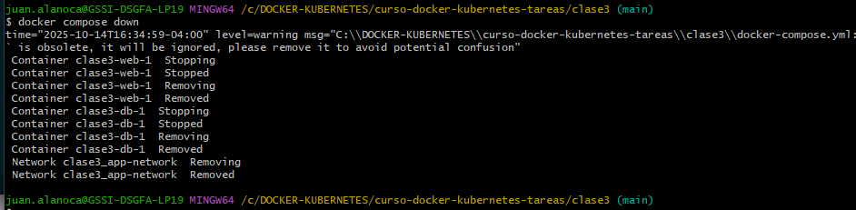
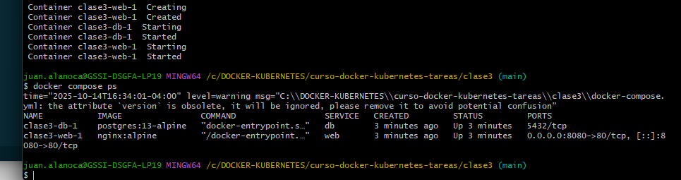

# Aplicación Nginx + PostgreSQL con Docker Compose

**Curso:** Docker & Kubernetes - Clase 3  
**Estudiante:** [Tu Nombre]

Aplicación simple que demuestra el uso de Docker Compose con Nginx sirviendo contenido estático y PostgreSQL como base de datos.

## Stack Tecnológico

- **Servicio Web:** Nginx (contenido estático)
- **Base de datos:** PostgreSQL

## Ejecución

**Screenshot:**

## Verificar persistencia de datos:

**Screenshot:**

## Verificar servicios

**Screenshot:**

