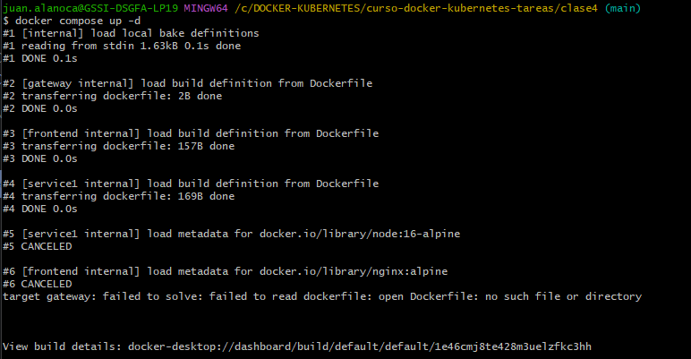

# docker-microservicios-clase4 

## 1. Título y Descripción

**Nombre del Proyecto:** Sistema de Blog con Microservicios, Cache y Gateway

**Descripción:**
Este proyecto implementa un sistema de blog básico utilizando una arquitectura de microservicios. Consta de un frontend estático, una API de posts (escrita en Node.js), un caché de Redis para mejorar el rendimiento de lectura, una base de datos MongoDB para la persistencia de datos y Nginx actuando como API Gateway para enrutar el tráfico entre el frontend y el backend, y gestionar el acceso a los servicios.

**Tecnologías Utilizadas:**
*   **Frontend:** HTML estático, servido por Nginx.
*   **Backend (API Posts):** Node.js con Express.js.
*   **Base de Datos:** MongoDB (para persistencia de posts).
*   **Caché:** Redis (para cachear posts).
*   **API Gateway:** Nginx.
*   **Orquestación:** Docker y Docker Compose.

## 2. Arquitectura


## 3. Servicios

| Servicio    | Tecnología        | Puerto (Interno) | Descripción                                               |
| :---------- | :---------------- | :--------------- | :-------------------------------------------------------- |
| `gateway`   | Nginx             | 8080             | Punto de entrada. Enruta `/` a `frontend` y `/api/*` a `service1`. Expuesto externamente. |
| `service1`  | Node.js (Express) | 5000             | API RESTful para gestionar posts, con integración Redis y MongoDB. |
| `redis`     | Redis             | 6379             | Base de datos en memoria utilizada como caché para los posts. |
| `db`        | MongoDB           | 27017            | Base de datos NoSQL para la persistencia de los posts.    |
| `frontend`  | Nginx             | 80               | Sirve el HTML estático de la interfaz de usuario del blog. |

## 4. Instrucciones de Uso

Para levantar y probar la aplicación:

1.  **Clonar el repositorio:**
    ```bash
    
    ```

2.  **Levantar todos los servicios con Docker Compose:**
    ```bash
    docker compose up -d
    ```
    Esto construirá las imágenes necesarias y levantará los cinco contenedores en segundo plano.

3.  **Verificar el estado de los servicios:**
    ```bash
    docker compose ps
    ```
    Deberías ver todos los servicios en estado `Up`.
**Screenshot:**



4.  **Ver los logs (opcional, para depuración):**
    ```bash
    docker compose logs -f
    ```

5.  **Acceder a la aplicación:**
    Abre tu navegador web y visita: `http://localhost:8080`
    Aquí verás el frontend del blog.

## 5. Endpoints de la API

Todos los endpoints del backend son accesibles a través del API Gateway en `http://localhost:8080/api/`.

*   **`GET /api/posts`**
    *   **Descripción:** Lista todos los posts disponibles. Utiliza caché de Redis.
    *   **Response (Cache MISS):**
        ```json
        {
          "source": "database",
          "data": [
            {
              "_id": "651a4f10a6d7b4c3d4e5f6g7",
              "title": "Mi Primer Post",
              "content": "Este es el contenido de mi primer post.",
              "createdAt": "2023-10-01T10:00:00.000Z",
              "__v": 0
            }
          ]
        }
        ```
    *   **Response (Cache HIT):**
        ```json
        {
          "source": "cache",
          "data": [
            {
              "_id": "651a4f10a6d7b4c3d4e5f6g7",
              "title": "Mi Primer Post",
              "content": "Este es el contenido de mi primer post.",
              "createdAt": "2023-10-01T10:00:00.000Z",
              "__v": 0
            }
          ]
        }
        ```

*   **`GET /api/posts/:id`**
    *   **Descripción:** Obtiene un post específico por su ID. Utiliza caché de Redis.
    *   **Response (Cache MISS/HIT, ejemplo con ID):**
        ```json
        {
          "source": "database",
          "data": {
            "_id": "651a4f10a6d7b4c3d4e5f6g7",
            "title": "Mi Primer Post",
            "content": "Este es el contenido de mi primer post.",
            "createdAt": "2023-10-01T10:00:00.000Z",
            "__v": 0
          }
        }
        ```

*   **`POST /api/posts`**
    *   **Descripción:** Crea un nuevo post y **invalida la caché** de la lista de todos los posts y del post individual si existiera.
    *   **Request:**
        ```json
        {
          "title": "Nuevo Post Increíble",
          "content": "Aquí va el contenido detallado del nuevo post."
        }
        ```
    *   **Response:**
        ```json
        {
          "message": "Post creado y caché invalidada",
          "post": {
            "title": "Nuevo Post Increíble",
            "content": "Aquí va el contenido detallado del nuevo post.",
            "_id": "651a511aa6d7b4c3d4e5f6g8",
            "createdAt": "2023-10-01T10:10:00.000Z",
            "__v": 0
          }
        }
        ```

*   **`GET /api/health`**
    *   **Descripción:** Endpoint de salud de la API de Posts.
    *   **Response:**
        ```json
        {
          "status": "UP",
          "service": "Posts API"
        }
        ```

*   **`GET /gateway/health`**
    *   **Descripción:** Endpoint de salud del Nginx API Gateway.
    *   **Response:**
        ```
        Gateway is UP and running!
        ```

## 6. Capturas de Pantalla

(Crea una carpeta `docs/screenshots/` y guarda tus imágenes aquí)

*   **Frontend funcionando:**
    `docs/screenshots/frontend.png`
    (Una captura de pantalla del navegador en `http://localhost:8080` con posts mostrándose).

*   **Resultado de `docker compose ps`:**
    `docs/screenshots/docker_ps.png`
    (Captura de la terminal con el comando `docker compose ps` y todos los servicios `Up`).

*   **Logs mostrando conexión a Redis y DB:**
    `docs/screenshots/logs_connections.png`
    (Captura de los logs de Docker Compose (`docker compose logs -f`) mostrando mensajes como "Conectado a MongoDB" y "Conectado a Redis").

*   **Respuesta de API con "source": "cache":**
    `docs/screenshots/api_cache_hit.png`
    (Captura de la terminal con `curl http://localhost:8080/api/posts` después de una segunda consulta, mostrando `"source": "cache"`).

*   **Respuesta de API con "source": "database":**
    `docs/screenshots/api_cache_miss.png`
    (Captura de la terminal con `curl http://localhost:8080/api/posts` en la primera consulta (o después de invalidar caché), mostrando `"source": "database"`).

---

### **Parte 5: Pruebas a Realizar**

Sigue estas instrucciones en tu terminal después de haber levantado los servicios (`docker compose up -d`).

#### **1. Cache Hit/Miss**

1.  **Primera consulta (cache MISS):**
    ```bash
    curl http://localhost:8080/api/posts
    ```
    *   **Resultado esperado:** La respuesta JSON debería mostrar `"source": "database"`. En los logs de `service1` (`docker compose logs service1`), deberías ver `Cache MISS para todos los posts. Obteniendo de DB...`.

2.  **Segunda consulta (cache HIT):**
    ```bash
    curl http://localhost:8080/api/posts
    ```
    *   **Resultado esperado:** La respuesta JSON debería mostrar `"source": "cache"`. En los logs de `service1`, deberías ver `Cache HIT para todos los posts`.

#### **2. Invalidación de Cache**

1.  **Crear un nuevo post:**
    ```bash
    curl -X POST http://localhost:8080/api/posts \
      -H "Content-Type: application/json" \
      -d '{"title":"Post de Prueba para Invalidación","content":"Este post debería invalidar la cache."}'
    ```
    *   **Resultado esperado:** La API responderá con un mensaje de éxito. En los logs de `service1`, deberías ver `Caché de todos los posts invalidada.` y `Caché de post ID: <ID_DEL_POST> invalidada.`.

2.  **Verificar que la caché se invalidó:**
    ```bash
    curl http://localhost:8080/api/posts
    ```
    *   **Resultado esperado:** La respuesta JSON debería mostrar `"source": "database"` (porque el caché se invalidó y ahora se obtiene de la DB de nuevo). El nuevo post debería estar presente en la lista. En los logs de `service1`, deberías ver `Cache MISS para todos los posts. Obteniendo de DB...`.

#### **3. Persistencia de Datos**

1.  **Asegúrate de que hay datos:**
    Si no has creado posts, usa el `POST /api/posts` para crear al menos uno.
    `curl -X POST http://localhost:8080/api/posts -H "Content-Type: application/json" -d '{"title":"Post Persistente","content":"Este post debería quedarse."}'`

2.  **Detener los servicios:**
    ```bash
    docker compose down
    ```
    *   **Resultado esperado:** Todos los contenedores se detienen y se eliminan. Los named volumes (`redis_data`, `mongodb_data`) persisten.

3.  **Levantar los servicios de nuevo:**
    ```bash
    docker compose up -d
    ```
    *   **Resultado esperado:** Los servicios se inician nuevamente.

4.  **Verificar que los datos persisten:**
    ```bash
    curl http://localhost:8080/api/posts
    ```
    *   **Resultado esperado:** Deberías ver el post "Post Persistente" (y cualquier otro que hayas creado) en la respuesta JSON. El `"source"` debería ser `"database"` en la primera consulta post-reiniciada.

#### **4. Gateway Routing**

1.  **Verificar salud del Gateway:**
    ```bash
    curl http://localhost:8080/gateway/health
    ```
    *   **Resultado esperado:** `Gateway is UP and running!`

2.  **Verificar salud de la API:**
    ```bash
    curl http://localhost:8080/api/health
    ```
    *   **Resultado esperado:** 
