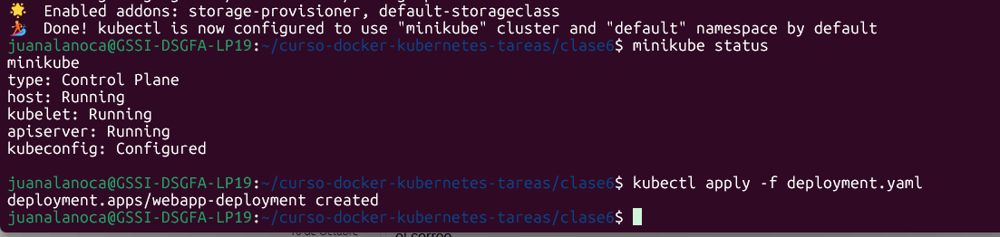
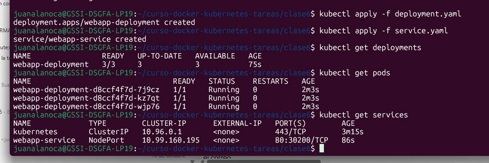
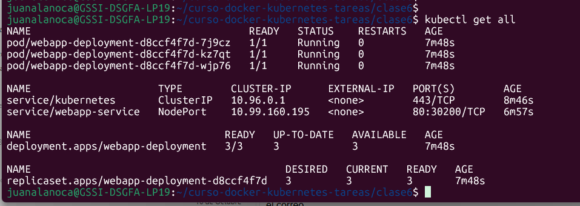
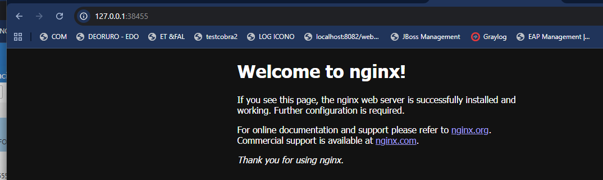
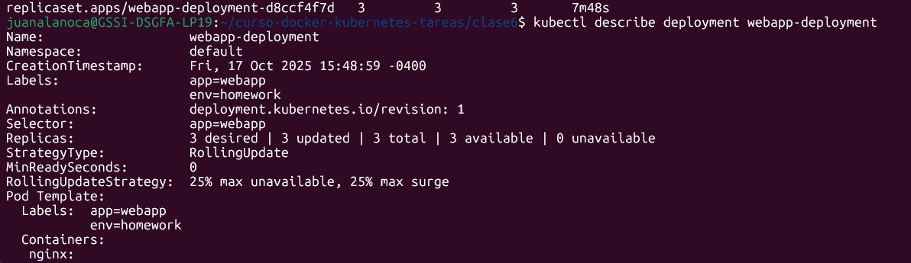
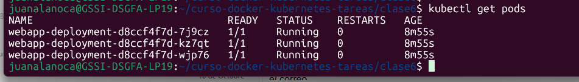
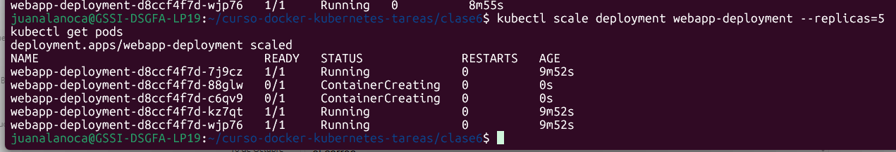

# Mi Aplicación Web con Kubernetes

**Curso:** Docker & Kubernetes - Clase 6
**Estudiante:** [Tu Nombre Completo]

Este repositorio contiene una aplicación web simple (Nginx) desplegada en Kubernetes, utilizando Deployments y Services para demostrar conceptos de escalabilidad y exposición de servicios.

## Stack

- **Aplicación:** Nginx (nginx:alpine)
- **Kubernetes:** minikube
- **Réplicas Iniciales:** 3

## Ejecución

1.  **Clonar el repositorio:**
    ```bash
    git clone https://github.com/juanalanoca/clase6.git
    cd [tu-repo]
    ```

2.  **Desplegar los recursos en Kubernetes:**
    ```bash
    kubectl apply -f deployment.yaml
    kubectl apply -f service.yaml
    ```

3.  **Acceder a la aplicación:**
    La aplicación estará accesible a través del NodePort `30200` en la IP de tu clúster de Kubernetes (Minikube).
    Para obtener la URL directamente si usas Minikube:
    ```bash
    minikube service webapp-service --url
    ```
    También puedes abrirla directamente:
    ```bash
    minikube service webapp-service
    ```
    La URL será similar a: `http://<IP_DE_TU_CLUSTER>:30200`

## Verificación

1.  **Verificar todos los recursos desplegados:**
    ```bash
    kubectl get all
    ```

2.  **Acceder a la web:**
    Abre la URL obtenida anteriormente en tu navegador: `http://<IP_DE_TU_CLUSTER>:30200`

3.  **Escalar el Deployment a 5 réplicas y verificar:**
    ```bash
    kubectl scale deployment webapp-deployment --replicas=5
    kubectl get pods
    ```

## Screenshots

Aquí se incluyen las capturas de pantalla de los pasos clave:

### Recursos desplegados (`kubectl get all`)




### verificacion de recursos


### Aplicación funcionando en el navegador


### Pods detallados (`kubectl get pods -o wide`)


### logs 


### Escalado a 5 réplicas (`kubectl get pods` después del escalado)


## Conceptos Kubernetes Aplicados

-   **Deployment:** Gestión declarativa de un conjunto de Pods idénticos.
-   **Service tipo NodePort:** Exposición de la aplicación al exterior a través de un puerto estático en cada nodo del clúster.
-   **Labels y Selectors:** Mecanismo para organizar recursos y permitir que los Services encuentren a los Pods correctos.
-   **Auto-healing:** Kubernetes detecta y reemplaza automáticamente los Pods fallidos para mantener el número deseado de réplicas.
-   **Escalado horizontal:** Capacidad de aumentar o disminuir el número de réplicas de una aplicación para manejar la carga.