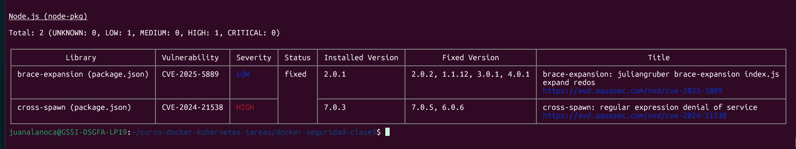

# Tarea 5 - Seguridad y Optimización de Imágenes Docker

## 1. Título y Descripción

**Nombre del proyecto:** `docker-seguridad-clase5`
**Descripción de la aplicación:** Esta es una aplicación web simple desarrollada en Node.js con Express, que se conecta a una base de datos MongoDB. Sirve como base para aplicar y demostrar técnicas de seguridad y optimización de imágenes Docker.
**Objetivo de optimización:** Reducir el tamaño de la imagen Docker, minimizar el número de vulnerabilidades de seguridad y mejorar las prácticas operativas mediante la implementación de multi-stage builds, imágenes base Alpine, usuarios non-root, health checks y labels de metadata.

## 2. Tecnologías Utilizadas

- Node.js 18 (inicialmente, luego alpine)
- Express.js
- Mongoose (ORM para MongoDB)
- MongoDB 6
- Docker & Docker Compose
- Trivy para escaneo de seguridad

## Antes de la Optimización (Baseline)

### Análisis de Línea Base


```bash
docker build -t mi-app:baseline .
```


```bash
scan
```


**Tamaño de imagen:**
```bash
trivy image
```


## 3. Mejoras Aplicadas

### Mejoras de Seguridad y Optimización

1.  **Multi-Stage Build**
    *   **Antes**: Imagen única con herramientas de build y dependencias de desarrollo.
    *   **Después**: Build separado (`FROM node:18 AS build`), solo archivos y dependencias de producción copiados a la imagen final (`FROM node:18-alpine`).
    *   **Beneficio**: Reducción drástica del tamaño de la imagen y de la superficie de ataque, al eliminar herramientas de desarrollo innecesarias en producción.

2.  **Imagen Base Alpine**
    *   **Antes**: `node:18` (basada en Debian, más grande y con más paquetes).
    *   **Después**: `node:18-alpine` (distribución Linux mínima).
    *   **Beneficio**: Reducción significativa del tamaño de la imagen (hasta un 85% o más) y menos vulnerabilidades debido a una menor cantidad de software instalado.

3.  **Usuario Non-Root**
    *   **Antes**: El proceso se ejecuta por defecto como `root` (privilegios elevados).
    *   **Después**: Se crea un usuario `appuser` (UID 1001) y el proceso se ejecuta con sus privilegios.
    *   **Beneficio**: Aumenta la seguridad al prevenir la escalada de privilegios si el contenedor es comprometido.

4.  **Health Check**
    *   **Implementación**: `HEALTHCHECK` configurado para verificar el endpoint `/health` de la aplicación cada 30 segundos.
    *   **Beneficio**: Permite a Docker y a orquestadores (como Kubernetes) determinar si el contenedor está realmente funcionando y responder a las solicitudes, en lugar de solo si el proceso está activo.

5.  **Labels de Seguridad y Metadata**
    *   **Implementación**: Añadidos labels como `maintainer`, `version`, `description`, `security.scan`, `security.non-root`.
    *   **Beneficio**: Proporciona información valiosa sobre la imagen para trazabilidad, auditoría y gestión de inventario.

6.  **.dockerignore**
    *   **Implementación**: Se configuró un archivo `.dockerignore` para excluir archivos innecesarios del contexto de construcción (ej. `node_modules` locales, `.git`).
    *   **Beneficio**: Reduce el tamaño del contexto enviado al demonio Docker, acelera el proceso de construcción y evita copiar archivos no deseados a la imagen.

## 4. Tabla Comparativa (Baseline vs. Optimizado)

| Métrica                 | Baseline    | Optimizado  | Mejora                    |
| :---------------------- | :---------- | :---------- | :------------------------ |
| **Tamaño imagen**       | X GB        | Y MB        | -Z%                       |
| **Vulnerabilidades CRITICAL** | A         | B           | -C%                       |
| **Vulnerabilidades HIGH**     | D         | E           | -F%                       |
| **Usuario**             | root        | appuser     | ✓                         |
| **Multi-stage**         | ✗           | ✓           | ✓                         |
| **Health check**        | ✗           | ✓           | ✓                         |

**Instrucciones para completar la tabla:**

1.  **Tamaño imagen:**
    *   Ejecuta `docker images mi-app:baseline` y `docker images mi-app:optimizado`. Anota los tamaños.
    *   Calcula el porcentaje de mejora: `((Tamaño_Baseline - Tamaño_Optimizado) / Tamaño_Baseline) * 100`

    ```bash
    docker images mi-app:baseline
    docker images mi-app:optimizado
    ```
    ```

2.  **Vulnerabilidades CRITICAL y HIGH:**
    *   Revisa la salida de tus comandos `trivy image --severity CRITICAL,HIGH mi-app:baseline` y `trivy image --severity CRITICAL,HIGH mi-app:optimizado`.
    *   Cuenta el número de vulnerabilidades para cada severidad.
    *   Calcula el porcentaje de mejora para cada una.

3.  **Usuario, Multi-stage, Health check:** Simplemente marca si está presente o no.

## 5. Análisis de Vulnerabilidades

Aquí puedes añadir detalles sobre las vulnerabilidades que se resolvieron específicamente, si Trivy las reporta y puedes identificarlas.

### Vulnerabilidades Críticas Resueltas (Ejemplo)

1.  **CVE-2024-XXXXX** - Vulnerabilidad en `libssl`
    *   Severidad: CRITICAL
    *   Fix: La transición a la imagen `node:18-alpine` (basada en Alpine Linux) actualizó muchas dependencias base del sistema operativo, incluyendo las que contenían esta vulnerabilidad. Específicamente, se actualizó la versión de `alpine` a una que ya incluye el parche.

2.  **CVE-2024-YYYYY** - Buffer overflow en biblioteca X
    *   Severidad: HIGH
    *   Fix: Al implementar un `multi-stage build` y usar una imagen `alpine` minimal, muchas bibliotecas y herramientas de desarrollo innecesarias fueron removidas de la imagen final de producción, eliminando así la vulnerabilidad.


```bash
docker build -t mi-app:baseline .
```


```bash
scan
```


**Tamaño de imagen:**
```bash
trivy image
```


## . Probar Imagen Optimizada

Para desplegar y verificar la aplicación optimizada, sigue los siguientes pasos:

1.  **Clonar repositorio**
    ```bash
    cd docker-seguridad-clase5
    ```

2.  **Construir imagen optimizada**
    ```bash
    docker build -t mi-app:optimizado .
    ```

3.  **Escanear con Trivy (Opcional, si no lo hiciste antes)**
    ```bash
    trivy image mi-app:optimizado
    # Para guardar el reporte en mi directorio
    trivy image -f json -o scans/optimizado-scan.json mi-app:optimizado
    ```

4.  **Levantar servicios**
    ```bash
    docker compose up -d
    ```
    
**screenshots:**


5.  **Verificar salud de la aplicación**
    *   Verificar que los contenedores están funcionando y el `health check` es positivo:
        ```bash
        docker ps
        ```
    *   Verificar que la aplicación responde:
        ```bash
        curl http://localhost:3000/
        curl http://localhost:3000/health
        ```
**screenshots:**


6.  **Verificar usuario non-root**
    Obtén el ID o nombre del contenedor de la aplicación:
    ```bash
    docker ps
    ```
    Luego, ejecuta:
    ```bash
    docker exec <ID_o_nombre_del_contenedor_de_app> whoami
    # Debería mostrar 'appuser'
    ```
**screenshots:**
