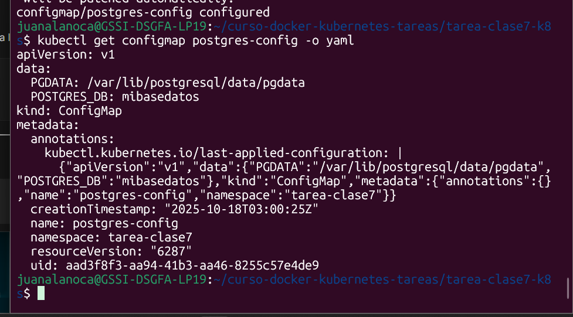
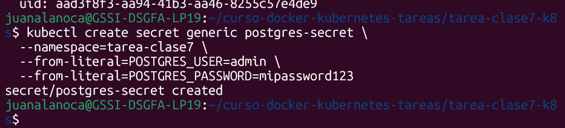
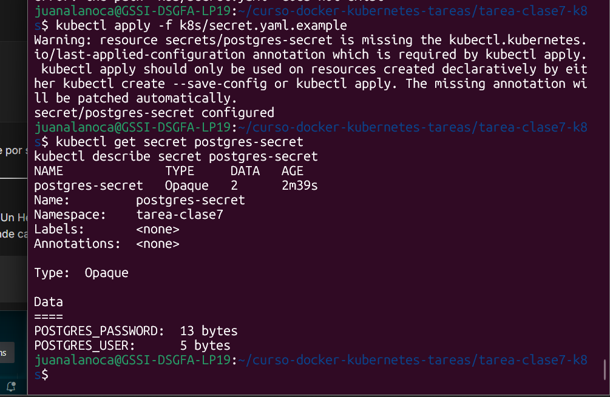
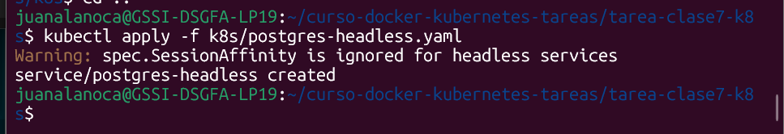
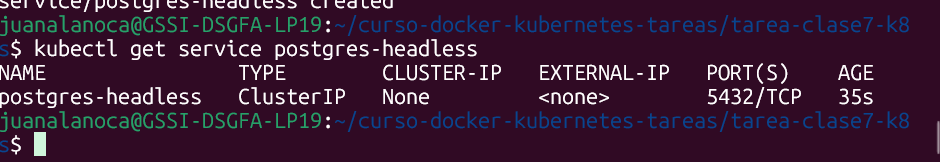

# Tarea 7: Namespaces, Configuración y Persistencia

**Curso:** Docker & Kubernetes - Clase 7
**Estudiante:** [Juan Carlos Alanoca]

En esta sesión profundizaremos en la organización de recursos con Namespaces, externalización de configuración con ConfigMaps y Secrets, y gestión de aplicaciones con estado usando StatefulSets con persistencia de datos
## Stack

## Ejecución

1.  **Clonar el repositorio:**
    ```bash
    git clone https://github.com/juanalanoca/clase7.git
    cd [tu-repo]
    ```

2.  **Crear Namespace:**
    ```bash
    kubectl create namespace tarea-clase7
    ```

3.  **crear:**
    Crea un archivo llamado k8s/namespace.yaml con el siguiente contenido:
    ```bash
    kubectl apply -f k8s/namespace.yaml
    ```
    aplica:
    ```bash
    kubectl apply -f k8s/namespace.yaml
    ```
    

## Configurar

1.  **Para evitar escribir --namespace=tarea-clase7 en cada comando, configuraremos nuestro contexto de kubectl para usar este namespace por defecto:**
    ```bash
    kubectl config set-context --current --namespace=tarea-clase7
    ```

2.  **Verificar:**
    Confirma que el namespace ha sido creado y que tu contexto actual apunta a él
 ```bash
    kubectl config view --minify | grep namespace:
```


## Screenshots

Aquí se incluyen las capturas de pantalla de los pasos clave:

### Comprueba configuracion


### creando Secrets


### Confirmando secrets


### Aplicando base de datos postgres


### Verificando bases de datos creados 



## Conceptos Kubernetes Aplicados

-   **Deployment:** Gestión declarativa de un conjunto de Pods idénticos.
-   **Service tipo NodePort:** Exposición de la aplicación al exterior a través de un puerto estático en cada nodo del clúster.
-   **Labels y Selectors:** Mecanismo para organizar recursos y permitir que los Services encuentren a los Pods correctos.
-   **Auto-healing:** Kubernetes detecta y reemplaza automáticamente los Pods fallidos para mantener el número deseado de réplicas.
-   **Escalado horizontal:** Capacidad de aumentar o disminuir el número de réplicas de una aplicación para manejar la carga.
