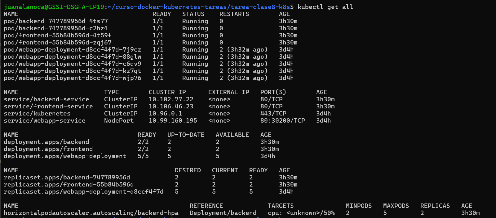
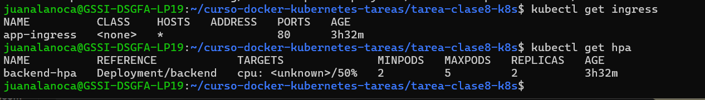
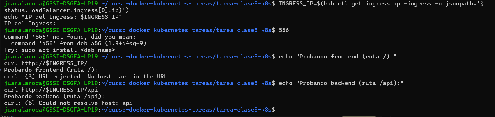
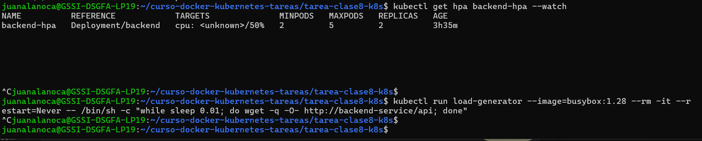
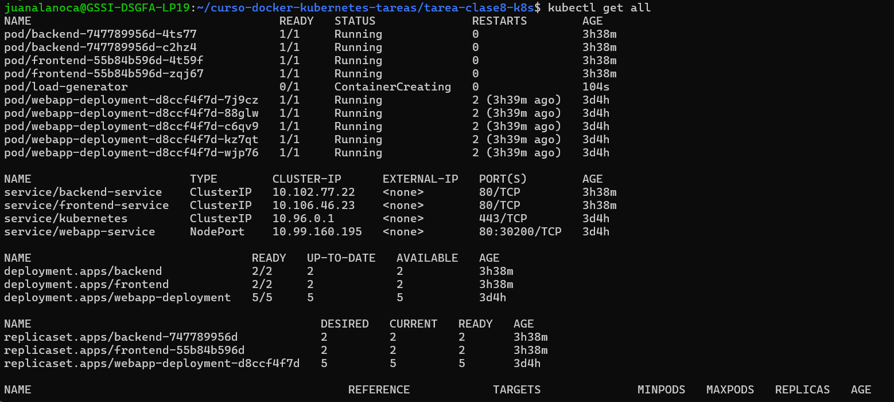
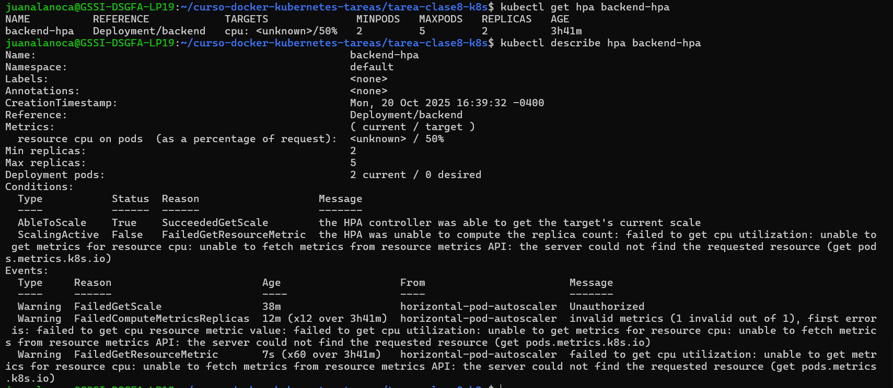
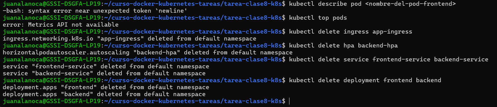

# tarea-clase8-k8s

## a) Descripción del Proyecto

Este proyecto despliega una aplicación web simple de dos capas en un clúster de Kubernetes, utilizando Nginx como frontend y backend. La configuración incluye conceptos clave de Kubernetes para gestionar el tráfico y el escalado:

- **Stack Desplegado:**
    - **Frontend:** Un servidor Nginx sirviendo contenido estático (por defecto la página de bienvenida de Nginx).
    - **Backend:** Otro servidor Nginx que simula un servicio API, accesible a través de la ruta `/api`.

- **Conceptos Aplicados:**
    - **Ingress:** Utilizado para el routing basado en rutas, dirigiendo el tráfico de la ruta `/` al servicio frontend y la ruta `/api` al servicio backend desde fuera del clúster.
    - **Health Probes (Liveness y Readiness):** Configuradas en ambos Deployments (frontend y backend) para asegurar que los Pods estén saludables y listos para recibir tráfico, mejorando la fiabilidad de la aplicación.
    - **Horizontal Pod Autoscaler (HPA):** Implementado en el Deployment del backend para escalar automáticamente los Pods (entre 2 y 5) en función de la utilización de CPU, manteniendo la disponibilidad y el rendimiento bajo carga.

## b) Instrucciones de Despliegue

Sigue estos pasos para desplegar la aplicación en tu clúster de Kubernetes (se recomienda Minikube).

### 1. Habilitar Addons de Minikube

Es crucial habilitar el controlador de Ingress y el servidor de métricas para que la aplicación funcione correctamente y el HPA pueda recopilar datos.

```bash
minikube addons enable ingress
minikube addons enable metrics-server
```


## Screenshots

Aquí se incluyen las capturas de pantalla de los pasos realizados en maquina local:

### Verificando componentes 


### Verificando componentes 


### Probando Ingresos


### Probando HPA con carga


### Comandos de verificación


### Comandos de verificación


### Muestra de estados HPA


### Comandos de Limpieza

